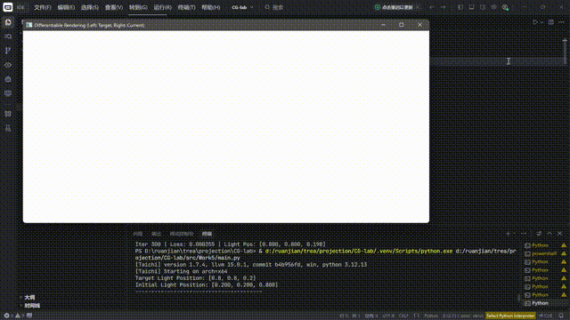

# 第六次作业

## 效果演示



## 项目架构

本项目采用模块化设计，主要包含以下文件：

- `src/Work5/main.py`：项目主入口，实现可微渲染和光线位置优化

## 代码逻辑

1. **初始化**：
   - 使用 Taichi 库初始化 CPU 环境
   - 声明像素缓冲区和光源位置（开启梯度追踪）
   - 生成目标参考图像（Ground Truth）

2. **渲染计算**：
   - 使用 Lambertian 漫反射模型计算球体的着色
   - 实现 Leaky Lambertian 模型（引入 0.1 泄漏系数）
   - 计算当前渲染结果与目标图像的均方误差（MSE Loss）

3. **梯度计算**：
   - 利用 Taichi 的自动微分（Tape）功能
   - 正向执行后自动反向传播计算参数梯度
   - 获取光源位置的梯度信息

4. **优化过程**：
   - 使用 Adam 优化算法更新光源位置
   - 迭代 300 次逐步优化
   - 实时显示目标图像和当前渲染结果

5. **可视化**：
   - 左半侧显示目标参考图像
   - 右半侧显示当前渲染结果
   - 实时更新窗口显示

## 实现功能

- **可微渲染**：实现允许梯度回传的光照计算
- **Lambertian 漫反射**：标准漫反射光照模型
- **Leaky Lambertian**：引入泄漏系数确保阴影区域也能产生梯度
- **自动微分**：使用 Taichi 的 Tape 功能进行自动求导
- **Adam 优化器**：使用自适应矩估计优化光源位置
- **实时可视化**：左右对比显示目标图像和当前渲染结果

## 技术特点

1. **可微编程**：利用 Taichi 的自动微分能力实现端到端可导
2. **Leaky Lambertian 模型**：解决传统 Lambertian 在阴影处梯度为零的问题
3. **Adam 优化算法**：自适应学习率的梯度下降优化
4. **跨平台兼容**：使用 CPU 架构确保不同平台都能运行
5. **实时反馈**：优化过程实时可视化

## 运行方式

在项目根目录下运行：

```bash
python src/Work5/main.py
```

运行后会弹出一个窗口，左侧显示目标图像，右侧显示当前渲染结果。控制台会输出优化过程：

```
Target Light Position: [0.8, 0.8, 0.2]
Initial Light Position: [0.200, 0.200, 0.800]
----------------------------------------
Iter 010 | Loss: 0.034521 | Light Pos: [0.231, 0.231, 0.762]
Iter 020 | Loss: 0.021456 | Light Pos: [0.289, 0.289, 0.701]
...
```

程序会运行 300 次迭代，光源位置会从初始的 `[0.2, 0.2, 0.8]` 逐渐优化接近目标位置 `[0.8, 0.8, 0.2]`，Loss 值逐步降低，右侧渲染结果逐渐与左侧目标图像一致。